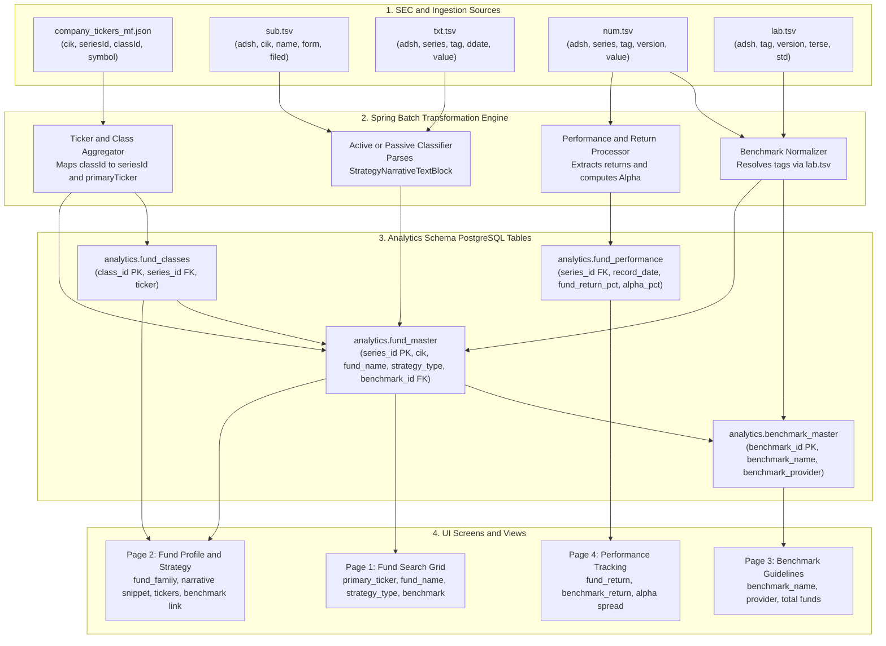

### Data Relations and Flow

```mermaid
flowchart TD

    subgraph Sources [1. SEC and Ingestion Sources]
        SRC_JSON["company_tickers_mf.json\n(cik, seriesId, classId, symbol)"]
        SRC_SUB["sub.tsv\n(adsh, cik, name, form, filed)"]
        SRC_TXT["txt.tsv\n(adsh, series, tag, ddate, value)"]
        SRC_NUM["num.tsv\n(adsh, series, tag, version, value)"]
        SRC_LAB["lab.tsv\n(adsh, tag, version, terse, std)"]
    end

    subgraph Engine [2. Spring Batch Transformation Engine]
        ENG_TICKER["Ticker and Class Aggregator\nMaps classId to seriesId and primaryTicker"]
        ENG_CLASS["Active or Passive Classifier\nParses StrategyNarrativeTextBlock"]
        ENG_BM["Benchmark Normalizer\nResolves tags via lab.tsv"]
        ENG_PERF["Performance and Return Processor\nExtracts returns and computes Alpha"]
    end

    subgraph Analytics [3. Analytics Schema PostgreSQL Tables]
        TBL_CLASSES["analytics.fund_classes\n(class_id PK, series_id FK, ticker)"]
        TBL_MASTER["analytics.fund_master\n(series_id PK, cik, fund_name, strategy_type, benchmark_id FK)"]
        TBL_BM["analytics.benchmark_master\n(benchmark_id PK, benchmark_name, benchmark_provider)"]
        TBL_PERF["analytics.fund_performance\n(series_id FK, record_date, fund_return_pct, alpha_pct)"]
    end

    subgraph UI [4. UI Screens and Views]
        PAGE_SEARCH["Page 1: Fund Search Grid\nprimary_ticker, fund_name, strategy_type, benchmark"]
        PAGE_OVERVIEW["Page 2: Fund Profile and Strategy\nfund_family, narrative snippet, tickers, benchmark link"]
        PAGE_BM["Page 3: Benchmark Guidelines\nbenchmark_name, provider, total funds"]
        PAGE_PERF["Page 4: Performance Tracking\nfund_return, benchmark_return, alpha spread"]
    end

    SRC_JSON --> ENG_TICKER
    SRC_SUB --> ENG_CLASS
    SRC_TXT --> ENG_CLASS
    SRC_NUM --> ENG_BM
    SRC_LAB --> ENG_BM
    SRC_NUM --> ENG_PERF

    ENG_TICKER --> TBL_CLASSES
    ENG_TICKER --> TBL_MASTER
    ENG_CLASS --> TBL_MASTER
    ENG_BM --> TBL_BM
    ENG_BM --> TBL_MASTER
    ENG_PERF --> TBL_PERF

    TBL_CLASSES --> TBL_MASTER
    TBL_MASTER --> TBL_BM

    TBL_MASTER --> PAGE_SEARCH
    TBL_MASTER --> PAGE_OVERVIEW
    TBL_CLASSES --> PAGE_OVERVIEW
    TBL_BM --> PAGE_BM
    TBL_PERF --> PAGE_PERF
```