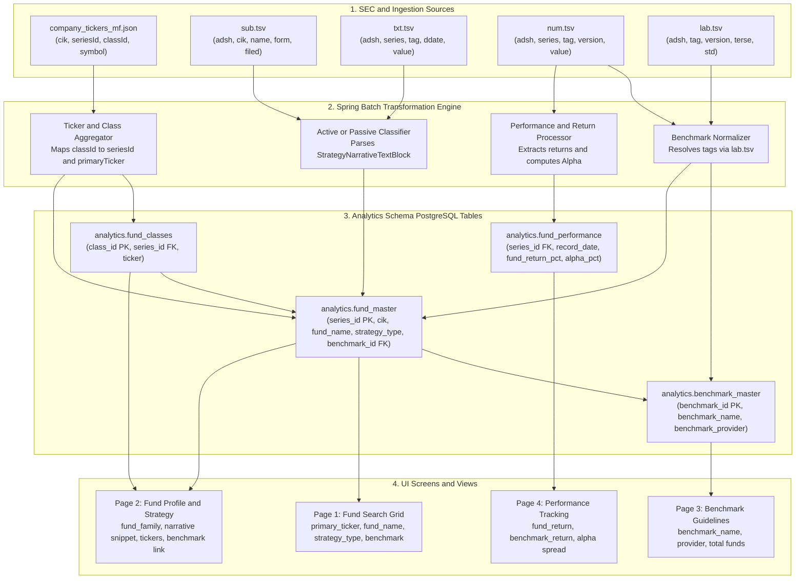

### Data Relations and Flow


## 1. SEC Form Matrix by Fund Type
| Fund Type | Registration & Prospectus Form (`sub.tsv: form`) | Holdings / Census Form | Reporting Cadence | Primary SEC Dataset / Source Table | How to Derive & Identify |
| :--- | :--- | :--- | :--- | :--- | :--- |
| **Open-End Mutual Funds (OEFs)** | • **`485BPOS`** (Annual post-effective update)<br>• **`485APOS`** (Material strategy change)<br>• **`497` / `497K`** (Prospectus supplements/stickers) | • **`N-PORT`** (Monthly holdings filed quarterly)<br>• **`N-CSR` / `N-CSRS`** (Semi-annual reports)<br>• **`N-CEN`** (Annual census) | **Annual** (Prospectus) + **Quarterly** (Holdings) | • `sec_financials.submissions`<br>• `sec_financials.company_tickers_mf`<br>• `sec_financials.text_disclosures` | `form IN ('485BPOS', '497')` AND joined via `series_id` to `company_tickers_mf`. Ticker ends in 'X' (5 letters) or has retail/institutional share classes (Class A, C, I). |
| **Exchange-Traded Funds (ETFs - Open-End)** | • **`485BPOS`** (Registered under Form N-1A)<br>• **`485APOS`**<br>• **`497`** | • **`N-PORT`**<br>• **`N-CEN`**<br>• Daily AP creation/redemption files | **Daily** (Holdings/Baskets) + **Annual** (Prospectus) | • `sec_financials.submissions`<br>• `sec_financials.company_tickers_mf`<br>• `sec_financials.text_disclosures` | `form IN ('485BPOS', '497')` where fund name or share class contains `'ETF'`, or `StrategyNarrativeTextBlock` contains creation unit/authorized participant language. |
| **Exchange-Traded Funds (ETFs - UIT Structure)** | • **`S-6`** (Securities Act of 1933)<br>• **`424B3` / `424B5`** (Prospectus amendments) | • **`N-CEN`**<br>• Daily basket creation files | **Daily** (Baskets) + **Static** (Portfolio) | • SEC EDGAR Corporate / Trust filings | Special cases like SPY (SPDR S&P 500 ETF Trust) or QQQ; filed under Unit Investment Trust rules, not Form N-1A. |
| **Closed-End Funds (CEFs)** | • **`N-2`** (Initial registration statement)<br>• **`N-2/A`** (Pre-effective amendment)<br>• **`N-2ASR`** (Automatic shelf registration) | • **`N-PORT`** (Holdings)<br>• **`N-CSR` / `N-CSRS`** (Semi-annual report)<br>• **`N-CEN`** (Annual census) | **Semi-Annual / Annual** (Filings) + **Daily** (Exchange Trading) | • EDGAR Form N-2 dataset<br>• `sec_financials.submissions` | `form LIKE 'N-2%'`. Absent from `company_tickers_mf` because they do not have multi-class series identifiers (`series_id` / `class_id`). |
| **Unit Investment Trusts (UITs - Traditional)** | • **`S-6`** (Initial filing)<br>• **`N-8B-2`** (Investment Company Act 1940 filing)<br>• **`487`** (Pricing amendment) | • **`N-CEN`** | **Fixed / Life-of-Trust** (Static basket; no ongoing active trading) | • EDGAR Form S-6 dataset<br>• `sec_financials.submissions` | `form IN ('S-6', 'N-8B-2')`. Zero or near-zero portfolio turnover rate; fixed termination date. |
| **Money Market Funds (MMFs)** | • **`485BPOS` / `N-1A`** (Governed by Rule 2a-7)<br>• **`N-CR`** (Material credit events) | • **`N-MFP` / `N-MFP2`** (Monthly portfolio schedule)<br>• **`N-CEN`** | **Daily** (Shadow NAV) + **Monthly** (Portfolio Holdings) | • SEC N-MFP dataset<br>• `sec_financials.submissions` | `form IN ('N-MFP', 'N-MFP2')` or N-1A filings where fund strategy explicitly references Rule 2a-7, WAM (Weighted Average Maturity), or Stable NAV. |
| **Business Development Companies (BDCs)** | • **`N-2`** (Registration statement)<br>• **`N-54A`** (Election to be regulated as BDC) | • **`10-K`** (Annual report)<br>• **`10-Q`** (Quarterly report)<br>• **`8-K`** (Current events) | **Quarterly** (10-Q) + **Annual** (10-K) | • SEC Public Company (10-K/10-Q) datasets | Regulated under Sections 54 through 65 of the 1940 Act; report on standard operating company forms (`10-K`, `10-Q`) rather than `N-PORT`. |

### Form Type Groupings & Purpose Summary
# SEC Form Taxonomy

| Category | SEC Forms | Description / Coverage |
|---|---|---|
| **Fund Prospectuses**<br>*(Annual Mandate/Strategy)* | `485BPOS`, `485APOS`, `497`, `497K` | → Open-End Funds, Open-End ETFs |
| **Closed-End Fund Filings**<br>*(Equity-like Capital)* | `N-2`, `N-2/A`, `N-2ASR` | → Closed-End Funds, BDCs |
| **Portfolio Holdings**<br>*(Quarterly/Monthly Assets)* | `N-PORT` *(Monthly data filed quarterly)*<br>`N-MFP2` *(Money Market Funds monthly)* | Portfolio holdings and asset-level reporting |
| **Unit Investment Trusts**<br>*(Static Baskets)* | `S-6`, `N-8B-2` | → UITs, UIT-structured ETFs |
| **Census & Operations**<br>*(Audits & Master Metadata)* | `N-CEN` *(Annual operations census)*<br>`N-CSR` *(Annual/Semi-annual shareholder report)* | Operational, census, and shareholder reporting |

## Summary

- **Fund Prospectuses** → Annual mandate and investment strategy
- **Closed-End Fund Filings** → Equity-like capital structures
- **Portfolio Holdings** → Periodic portfolio/asset-level data
- **Unit Investment Trusts** → Static investment baskets
- **Census & Operations** → Fund operations, census, and shareholder reporting


## Fund v/s Share Class v/s Benchmark in SEC/EDGAR ```N-1A Form``` Filings
|Entity:|What It Is:|SEC Identifier:|Key Characteristic:|
|-------|-----------|---------------|-------------------|
|Fund (Series)|"The distinct pooled investment vehicle that holds the actual basket of securities (stocks, bonds, cash). All classes share the same manager, portfolio, and strategy."|series_id (S0000xxxxx)|"Investment objective| strategy narrative, total portfolio value."|
|Share Class (Contract)|"A specific ownership slice of the fund tailored to different investor types. Each class has distinct fee structures, minimum investments, tickers, and expense ratios."|class_id (C0000xxxxx)|"Ticker symbol, 12b-1 fees, gross/net expense ratios, load waivers."|
|Comparative Market Index|"An external, unmanaged benchmark against which the fund's performance is measured under SEC Item 4 regulatory disclosure rules."|Dimensional Axis Member (measure)|"Not owned by the fund; reflects no deduction for fees, expenses, or taxes (e.g., Russell 2000, S&P 500)."|
